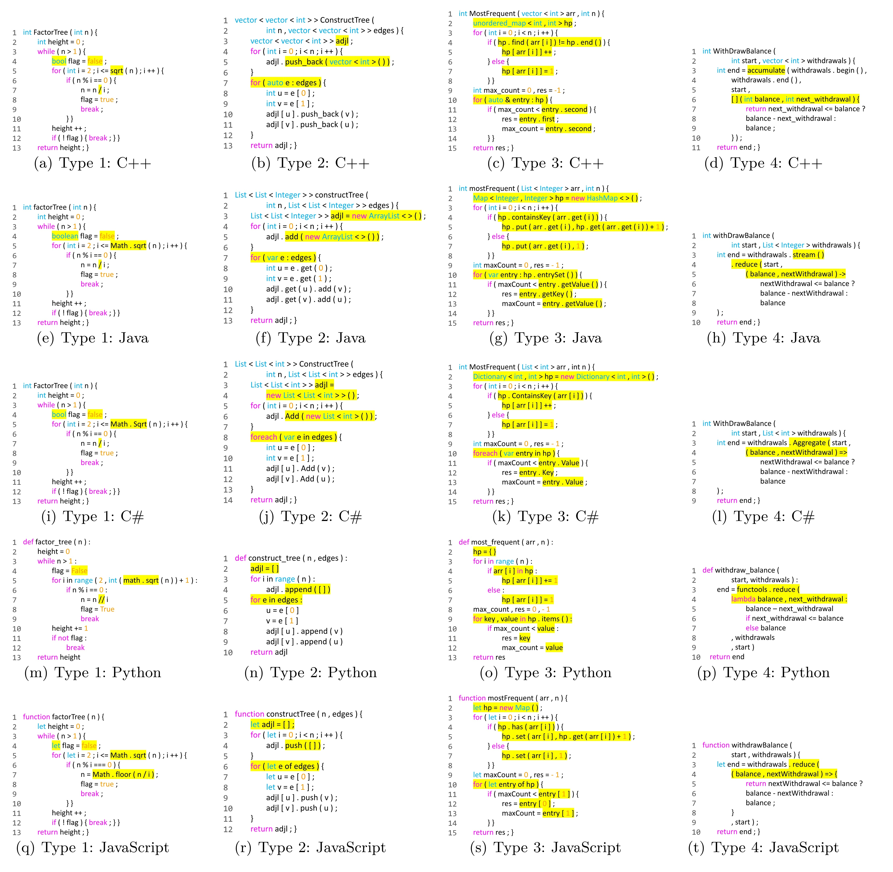

# Taxonomy
We develop a taxonomy that categorizes code translation tasks into four primary types according to their complexity and knowledge dependence: 
- Token Level (Type 1): Map trivial tokens to their equivalent in the target
- Syntactic Level (Type 2): Migrate syntactic structures based on linguistic rules
- Library Level (Type 3): Migrate library to their equivalent in the target language
- Algorithm Level (Type 4): Reimplement the program in the target language using a different algorithm

## Taxonomy Examples
The following image shows examples of four types of translation.

## Taxonomy experiment on TransCoder-test-categorized
Here are complete results of experiment performed on catagorized TransCoder-test benchmark.

| Full Dataset  | BLEU  | CodeBLEU | EM    | CA    |
|---------------|-------|----------|-------|-------|
| Naive Copy    | 78.39 | 79.96    | 1.05  | 29.55 |
| CodeBERT      | 87.95 | 86.79    | 23.42 | 72.59 |
| CodeT5        | 90.47 | 90.00    | 32.17 | 82.23 |
| TransCoder    | 84.23 | 85.00    | 16.03 | 80.30 |
| TransCoder-ST | 83.95 | 84.90    | 16.77 | 84.37 |

| Type-1        | BLEU  | CodeBLEU | EM    | CA    |
|---------------|-------|----------|-------|-------|
| Naive Copy    | 90.47 | 89.68    | 2.60  | 52.43 |
| CodeBERT      | 92.96 | 91.42    | 38.28 | 83.98 |
| CodeT5        | 95.80 | 94.73    | 48.44 | 91.75 |
| TransCoder    | 92.04 | 91.51    | 29.43 | 93.20 |
| TransCoder-ST | 91.92 | 91.30    | 31.51 | 94.17 |

| Type-2        | BLEU  | CodeBLEU | EM    | CA    |
|---------------|-------|----------|-------|-------|
| Naive Copy    | 76.22 | 76.97    | 0.00  | 15.29 |
| CodeBERT      | 86.74 | 85.64    | 17.30 | 67.65 |
| CodeT5        | 88.90 | 88.31    | 25.22 | 75.29 |
| TransCoder    | 83.54 | 83.63    | 10.56 | 79.41 |
| TransCoder-ST | 83.06 | 83.25    | 9.68  | 85.29 |

| Type-3        | BLEU  | CodeBLEU | EM    | CA    |
|---------------|-------|----------|-------|-------|
| Naive Copy    | 60.92 | 67.80    | 0.00  | 4.4   |
| CodeBERT      | 81.18 | 80.62    | 7.17  | 56.04 |
| CodeT5        | 83.67 | 84.42    | 14.80 | 73.63 |
| TransCoder    | 71.82 | 75.94    | 1.35  | 52.75 |
| TransCoder-ST | 71.56 | 76.36    | 2.24  | 60.44 |
